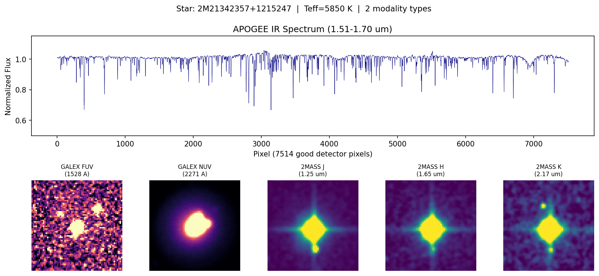
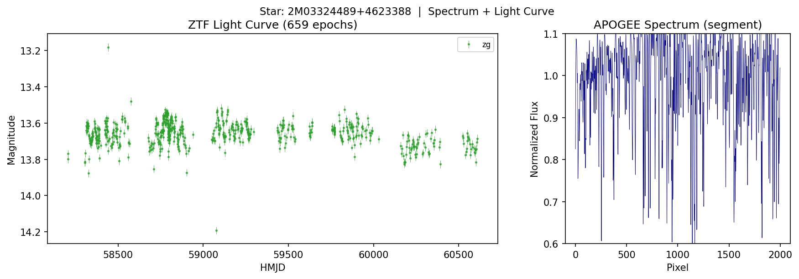
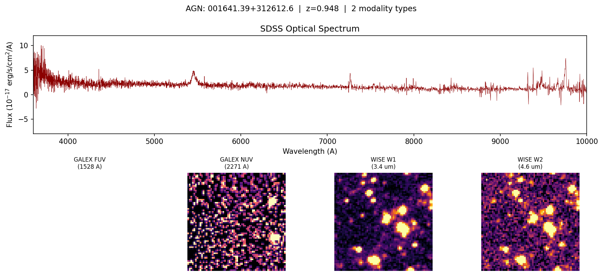

# OmniSky: 1.58 Million Pre-Cross-Matched Astronomical Objects from 12 Surveys

The first publicly available, pre-cross-matched astronomical dataset that unifies **all three modality types** -- spectra, light curves, and images -- into a single table. **1,580,216 objects** across three populations (stars, galaxies, AGN) are joined from **12 major surveys** spanning UV through mid-infrared. Each row is one physical object with all available observations already paired.

### Why This Dataset?

Existing multimodal astronomical datasets either provide raw survey collections that users must cross-match themselves, or cover only 1-2 modalities for a single population:

| Dataset | Objects | Modalities | Surveys | Populations | Pre-joined? |
|---------|---------|-----------|---------|-------------|-------------|
| **OmniSky (this)** | **1.58M** | **Spectra + Light Curves + Images** | **12** | **Stars, Galaxies, AGN** | **Yes** |
| [Multimodal Universe](https://huggingface.co/MultimodalUniverse) | 100M+ (separate) | Spectra + LC + Images | 20+ | Mixed | No (raw collections) |
| [AstroCLIP](https://arxiv.org/abs/2310.03024) | 198k | Spectra + Images | 2 | Galaxies only | Yes |
| [AstroM3](https://huggingface.co/datasets/AstroMLCore/AstroM3Dataset) | 21k | Spectra + LC + Metadata | 6 | Variable stars only | Yes |
| [DESI/HSC](https://huggingface.co/datasets/Smith42/desi_hsc_crossmatched) | 19k | Spectra + Images | 2 | Galaxies only | Yes |

OmniSky is ready for multimodal representation learning, transfer learning across wavelengths, population classification, and any task requiring multiple views of the same astronomical object in a single row.

### Example Objects

**Star: 2M21342357+1215247** (Teff=5850 K) — APOGEE IR spectrum + GALEX UV + 2MASS near-IR images:


**Star: 2M03324489+4623388** — APOGEE spectrum + 659-epoch ZTF multi-band light curve:


**AGN: 001641.39+312612.6** (z=0.948) — SDSS optical spectrum + GALEX UV + WISE mid-IR images:


### Dataset at a Glance


*Modality coverage by population and survey. Stars have near-complete spectral and image coverage; galaxies and AGN are image-dominated.*


*Hertzsprung-Russell diagram for 100,000 stars with Gaia photometry. Clean main sequence, red giant branch, and red clump confirm correct Gaia-APOGEE cross-matching.*


*Match separation distributions for all cross-matched surveys. Sharp peaks near 0" with no flat component confirm matches are real associations, not random.*


*Sky coverage per survey. Each survey's footprint matches its known observational coverage.*


*Median stacked spectra per population. APOGEE stars show absorption features; SDSS galaxies and AGN show expected spectral shapes.*


*Effective temperature cross-validation: APOGEE (high-res IR spectroscopy) vs Gaia GSP-Phot (low-res photometry). Tight 1:1 core with known Gaia failures at low Galactic latitude (blue points in right panel).*


*Distribution of modality types per object. 78% of stars have >= 2 modality types; 22% have all three (spectra + light curves + images).*

---

## Quick Start

### Installation

```bash
pip install datasets numpy pandas pyarrow
# Optional for visualization:
pip install matplotlib astropy
```

### Load the dataset

```python
from datasets import load_dataset
import numpy as np

# Stream without downloading everything (recommended)
ds = load_dataset("kshitijd/omnisky", streaming=True)

# Or download fully (~244 GB)
ds = load_dataset("kshitijd/omnisky")
```

### Get a star with an infrared spectrum

```python
row = ds["train"][0]
if row["population"] == "star" and row["apogee_flux"] is not None:
    flux = np.array(row["apogee_flux"], dtype=np.float32)       # (7514,) normalized IR spectrum
    flux_err = np.array(row["apogee_flux_err"], dtype=np.float32)
    print(f"APOGEE spectrum: {flux.shape}, median flux = {np.median(flux):.3f}")
```

### Get an image cutout (important: reconstruction step)

Image columns are stored as nested lists representing 64x64 pixel arrays. When loaded from Parquet, they appear as 1D arrays of lists. Reconstruct with `.tolist()`:

```python
# Correct way to load images:
if row["twomass_j"] is not None:
    img = np.array(row["twomass_j"].tolist(), dtype=np.float32)  # (64, 64)
    print(f"2MASS J-band: shape={img.shape}, range=[{img.min():.1f}, {img.max():.1f}]")
```

### Plot a 2MASS JHK composite image

```python
import matplotlib.pyplot as plt
import numpy as np

row = ds["train"][0]
fig, axes = plt.subplots(1, 3, figsize=(9, 3))
for ax, band, label in zip(axes, ["twomass_j", "twomass_h", "twomass_k"], ["J", "H", "K"]):
    if row[band] is not None:
        img = np.array(row[band].tolist(), dtype=np.float32)
        ax.imshow(img, origin="lower", cmap="viridis")
        ax.set_title(f"2MASS {label}")
    ax.axis("off")
plt.suptitle(f"{row['object_id']} ({row['population']})")
plt.tight_layout()
plt.savefig("2mass_jhk.png", dpi=150)
```

### Plot GALEX UV images

```python
fig, axes = plt.subplots(1, 2, figsize=(6, 3))
for ax, band, label in zip(axes, ["galex_fuv", "galex_nuv"], ["FUV", "NUV"]):
    if row[band] is not None:
        img = np.array(row[band].tolist(), dtype=np.float32)
        ax.imshow(img, origin="lower", cmap="magma")
        ax.set_title(f"GALEX {label}")
    ax.axis("off")
plt.tight_layout()
plt.savefig("galex_uv.png", dpi=150)
```

### Plot multi-wavelength cutouts side by side (UV to mid-IR)

```python
fig, axes = plt.subplots(1, 7, figsize=(21, 3))
bands = [
    ("galex_fuv", "GALEX FUV", "magma"),
    ("galex_nuv", "GALEX NUV", "magma"),
    ("twomass_j", "2MASS J", "viridis"),
    ("twomass_h", "2MASS H", "viridis"),
    ("twomass_k", "2MASS K", "viridis"),
    ("unwise_w1", "WISE W1", "inferno"),
    ("unwise_w2", "WISE W2", "inferno"),
]
for ax, (col, label, cmap) in zip(axes, bands):
    if row[col] is not None:
        img = np.array(row[col].tolist(), dtype=np.float32)
        ax.imshow(img, origin="lower", cmap=cmap)
        ax.set_title(label, fontsize=9)
    else:
        ax.text(0.5, 0.5, "N/A", ha="center", va="center", transform=ax.transAxes)
    ax.axis("off")
plt.suptitle(f"{row['object_id']} ({row['population']})")
plt.tight_layout()
plt.savefig("multi_wavelength.png", dpi=150)
```

### Plot an APOGEE spectrum

```python
row = ds["train"][0]
if row["apogee_flux"] is not None:
    flux = np.array(row["apogee_flux"], dtype=np.float32)
    plt.figure(figsize=(12, 3))
    plt.plot(flux, lw=0.5, color="navy")
    plt.xlabel("Pixel (7514 good detector pixels)")
    plt.ylabel("Normalized Flux")
    plt.title(f"APOGEE IR Spectrum: {row['object_id']}")
    plt.tight_layout()
    plt.savefig("apogee_spectrum.png", dpi=150)
```

### Plot GALAH spectra (4 separate bands)

```python
fig, axes = plt.subplots(4, 1, figsize=(12, 8), sharex=False)
galah_bands = [
    ("galah_flux_blue", "galah_lambda_blue", "Blue (4713-4903 A)"),
    ("galah_flux_green", "galah_lambda_green", "Green (5648-5873 A)"),
    ("galah_flux_red", "galah_lambda_red", "Red (6478-6737 A)"),
    ("galah_flux_ir", "galah_lambda_ir", "IR (7585-7887 A)"),
]
for ax, (flux_col, lam_col, label) in zip(axes, galah_bands):
    if row[flux_col] is not None and row[lam_col] is not None:
        flux = np.array(row[flux_col], dtype=np.float32)
        lam = np.array(row[lam_col], dtype=np.float32)
        ax.plot(lam, flux, lw=0.5)
        ax.set_ylabel("Flux")
    ax.set_title(f"GALAH {label}", fontsize=9)
ax.set_xlabel("Wavelength (A)")
plt.suptitle(f"GALAH Spectrum: {row['object_id']}")
plt.tight_layout()
plt.savefig("galah_spectrum.png", dpi=150)
```

### Plot a ZTF multi-band light curve

```python
if row["ztf_time"] is not None:
    time = np.array(row["ztf_time"])
    mag = np.array(row["ztf_mag"])
    magerr = np.array(row["ztf_magerr"])
    band = np.array(row["ztf_band"])

    plt.figure(figsize=(10, 4))
    colors = {"zg": "green", "zr": "red", "zi": "orange"}
    for b in np.unique(band):
        mask = band == b
        plt.errorbar(time[mask], mag[mask], yerr=magerr[mask],
                     fmt='.', label=b, color=colors.get(b, "gray"), ms=3, alpha=0.7)
    plt.gca().invert_yaxis()
    plt.xlabel("HJD (Heliocentric Julian Date)")
    plt.ylabel("Magnitude")
    plt.legend()
    plt.title(f"ZTF Light Curve: {row['object_id']}")
    plt.tight_layout()
    plt.savefig("ztf_lightcurve.png", dpi=150)
```

### Plot a TESS light curve

```python
if row["flatiron_tess_time"] is not None:
    time = np.array(row["flatiron_tess_time"], dtype=np.float64)
    flux = np.array(row["flatiron_tess_flux"], dtype=np.float32)

    plt.figure(figsize=(10, 3))
    plt.plot(time, flux, '.', ms=1, alpha=0.5)
    plt.xlabel("BTJD (Barycentric TESS Julian Date)")
    plt.ylabel("Normalized Flux")
    plt.title(f"TESS Light Curve: {row['object_id']}")
    plt.tight_layout()
    plt.savefig("tess_lightcurve.png", dpi=150)
```

### Filter by population

```python
# All stars with spectra AND images
stars = ds["train"].filter(
    lambda x: x["population"] == "star" and x["n_spectra"] > 0 and x["n_images"] > 0
)

# Objects with >= 2 modality types (the cross-modal benchmark subset)
multimodal = ds["train"].filter(lambda x: x["n_modality_types"] >= 2)

# AGN with light curves
agn_variable = ds["train"].filter(
    lambda x: x["population"] == "agn" and x["n_lightcurves"] > 0
)
```

### Use the train/val/test split

```python
# The dataset includes a HEALPix-based spatial split (70/15/15)
train = ds["train"].filter(lambda x: x["split"] == "train")
val = ds["train"].filter(lambda x: x["split"] == "val")
test = ds["train"].filter(lambda x: x["split"] == "test")
```

### Memory-efficient loading with pandas

```python
import pandas as pd
import glob

# Load one shard (~5000 rows, ~400 MB - 1.2 GB depending on population)
df = pd.read_parquet("00000.parquet")

# Load only specific columns (much less RAM)
df = pd.read_parquet("00000.parquet", columns=["object_id", "population", "ra", "dec",
                                                 "apogee_flux", "n_spectra", "n_modality_types"])

# Iterate shard by shard (recommended for large-scale processing)
for f in sorted(glob.glob("*.parquet")):
    chunk = pd.read_parquet(f)
    stars = chunk[chunk["population"] == "star"]
    # process...
    del chunk
```

### Build a PyTorch DataLoader

```python
import torch
from torch.utils.data import Dataset, DataLoader
import pandas as pd
import numpy as np
import glob

class OmniSkyDataset(Dataset):
    """Memory-efficient dataset that loads one shard at a time."""

    def __init__(self, shard_dir, population=None, require_modalities=None):
        self.files = sorted(glob.glob(f"{shard_dir}/*.parquet"))
        self.index = []
        for si, f in enumerate(self.files):
            df = pd.read_parquet(f, columns=["population", "n_spectra", "n_lightcurves", "n_images"])
            for ri in range(len(df)):
                if population and df.iloc[ri]["population"] != population:
                    continue
                if require_modalities:
                    if "spectra" in require_modalities and df.iloc[ri]["n_spectra"] == 0:
                        continue
                    if "images" in require_modalities and df.iloc[ri]["n_images"] == 0:
                        continue
                self.index.append((si, ri))
            del df
        self._cache_si = -1
        self._cache_df = None

    def __len__(self):
        return len(self.index)

    def __getitem__(self, idx):
        si, ri = self.index[idx]
        if si != self._cache_si:
            self._cache_df = pd.read_parquet(self.files[si])
            self._cache_si = si
        row = self._cache_df.iloc[ri]

        sample = {"object_id": row["object_id"], "population": row["population"]}

        # Spectrum
        if row.get("apogee_flux") is not None and isinstance(row["apogee_flux"], (list, np.ndarray)):
            sample["spectrum"] = torch.tensor(np.array(row["apogee_flux"], dtype=np.float32))

        # Image (2MASS J-band) — note .tolist() for 2D reconstruction
        if row.get("twomass_j") is not None and isinstance(row["twomass_j"], (list, np.ndarray)):
            img = np.array(row["twomass_j"].tolist(), dtype=np.float32)
            sample["image"] = torch.tensor(img).unsqueeze(0)  # (1, 64, 64)

        return sample

# Usage
dataset = OmniSkyDataset("./shards/", population="star", require_modalities=["spectra", "images"])
loader = DataLoader(dataset, batch_size=32, shuffle=True, num_workers=2)
```

---

## Dataset Summary

| | Stars | Galaxies | AGN | Total |
|---|---|---|---|---|
| **Count** | 591,303 | 238,516 | 750,397 | **1,580,216** |
| **>= 2 modality types** | 78% | 46% | 19% | |
| **All 3 modality types** | 22% | 0% (no LC by design) | 4% | |
| **Median surveys per object** | 5 | 2 | 3 | |

### Per-Source Coverage

**Stars (591,303)**

| Source | Column | Coverage |
|--------|--------|----------|
| APOGEE DR17 | `apogee_flux` | 100% |
| Gaia DR3 BP/RP | `flatiron_gaia_coeff` | 47% |
| GALAH DR4 | `galah_flux_blue` | 5% |
| TESS | `flatiron_tess_flux` | 10% |
| ZTF DR23 | `ztf_time` | 13% |
| 2MASS | `twomass_j/h/k` | 100% |
| GALEX | `galex_fuv/nuv` | 100% |
| unWISE | `unwise_w1/w2` | 98% |

**Galaxies (238,516)**

| Source | Column | Coverage |
|--------|--------|----------|
| SDSS DR17 | `sdss_flux` | 9% |
| DESI EDR | `flatiron_desi_spectrum_flux` | 14% |
| GALEX | `galex_fuv/nuv` | 100% |
| unWISE | `unwise_w1/w2` | 98% |

**AGN (750,397)**

| Source | Column | Coverage |
|--------|--------|----------|
| SDSS DR17 | `sdss_flux` | 18% |
| ZTF DR23 | `ztf_time` | 9% |
| GALEX | `galex_fuv/nuv` | 100% |
| unWISE | `unwise_w1/w2` | 88% |

---

## Cross-Match Quality

All positional cross-matches use `astropy.coordinates.SkyCoord.match_to_catalog_sky()` with a **3 arcsecond** radius. Catalog positions are propagated to each survey's observation epoch using Gaia DR3 proper motions before matching.

| Metric | Value |
|--------|-------|
| Median match separation | 0.08" |
| Mean false match rate (shifted-catalog test) | 0.02% |
| Max false match rate (DESI) | 0.06% |
| Stars with proper motion data | 99.2% |
| Median proper motion | 7.3 mas/yr |

Match separations are stored in `{source}_match_sep_arcsec` columns so users can apply custom quality cuts.

---

## Data Sources

### Spectra

| Source | Instrument | Wavelength | Resolution | Population |
|--------|-----------|------------|------------|------------|
| [APOGEE DR17](https://www.sdss4.org/dr17/irspec/) | APOGEE (APO + LCO) | 1.51--1.70 um (IR) | R ~ 22,500 | Stars |
| [Gaia DR3 BP/RP](https://www.cosmos.esa.int/web/gaia/dr3) | Gaia BP/RP | 330--1050 nm | R ~ 50--100 | Stars |
| [GALAH DR4](https://www.galah-survey.org/) | HERMES (AAT) | 4713--7887 A | R ~ 28,000 | Stars |
| [SDSS DR17](https://www.sdss4.org/dr17/spectro/) | BOSS / eBOSS | 3600--10400 A | R ~ 2000 | Galaxies, AGN |
| [DESI EDR](https://data.desi.lbl.gov/) | DESI | 3600--9800 A | R ~ 2000--5000 | Galaxies, AGN |

### Light Curves

| Source | Instrument | Bandpass | Cadence | Population |
|--------|-----------|----------|---------|------------|
| [TESS](https://tess.mit.edu/) | TESS | 600--1000 nm | 2--30 min | Stars, AGN |
| [ZTF DR23](https://www.ztf.caltech.edu/) | ZTF (Palomar) | g, r, i | 1--3 day | Stars, AGN |

### Images

| Source | Instrument | Bands | Pixel Scale | Cutout Size | Population |
|--------|-----------|-------|-------------|-------------|------------|
| [2MASS](https://irsa.ipac.caltech.edu/Missions/2mass.html) | 2MASS | J, H, K | ~1 arcsec/px | 64 x 64 | Stars |
| [GALEX](https://galex.stsci.edu/) | GALEX | FUV, NUV | ~1.5 arcsec/px | 64 x 64 | All |
| [unWISE](https://unwise.me/) | WISE | W1, W2 | ~2.75 arcsec/px | 64 x 64 | All |
| [Legacy Survey](https://www.legacysurvey.org/) | DECam / Mosaic / 90Prime | g, r, z | 0.262 arcsec/px | 64 x 64 | All |

---

## Schema

### Core columns (all objects)

| Column | Type | Description |
|--------|------|-------------|
| `object_id` | string | Unique identifier (APOGEE 2MASS ID for stars, PROVABGS ID for galaxies, SDSS DR16Q name for AGN) |
| `ra` | float64 | Right ascension (degrees, J2000) |
| `dec` | float64 | Declination (degrees, J2000) |
| `population` | string | `"star"`, `"galaxy"`, or `"agn"` |
| `pmra` | float64 | Proper motion in RA (mas/yr, Gaia convention: mu_alpha * cos(dec)). 0 for extragalactic objects. |
| `pmdec` | float64 | Proper motion in Dec (mas/yr). 0 for extragalactic objects. |
| `n_spectra` | int | Count of spectral datasets with data |
| `n_lightcurves` | int | Count of light curve datasets with data |
| `n_images` | int | Count of image bands with data |
| `n_modality_types` | int | Count of modality types with data (0--3: spectra, light curves, images) |
| `split` | string | `"train"` (70%), `"val"` (15%), or `"test"` (15%) -- HEALPix spatial split |

### Spectra columns

| Column | Type | Shape | Description |
|--------|------|-------|-------------|
| `apogee_flux` | list[float32] | (7514,) | APOGEE normalized flux, cropped to good detector pixels |
| `apogee_flux_err` | list[float32] | (7514,) | APOGEE flux uncertainty |
| `galah_flux_blue` | list[float32] | variable | GALAH blue band flux (4713--4903 A) |
| `galah_lambda_blue` | list[float32] | variable | GALAH blue band wavelength |
| `galah_flux_green` | list[float32] | variable | GALAH green band flux (5648--5873 A) |
| `galah_lambda_green` | list[float32] | variable | GALAH green band wavelength |
| `galah_flux_red` | list[float32] | variable | GALAH red band flux (6478--6737 A) |
| `galah_lambda_red` | list[float32] | variable | GALAH red band wavelength |
| `galah_flux_ir` | list[float32] | variable | GALAH IR band flux (7585--7887 A) |
| `galah_lambda_ir` | list[float32] | variable | GALAH IR band wavelength |
| `sdss_flux` | list[float32] | variable | SDSS/BOSS spectral flux (10^-17 erg/s/cm^2/A) |
| `sdss_loglam` | list[float32] | variable | SDSS log10(wavelength / A) |
| `sdss_ivar` | list[float32] | variable | SDSS inverse variance |
| `flatiron_gaia_coeff` | list[float32] | (110,) | Gaia BP/RP spectral coefficients (requires GaiaXPy to reconstruct) |
| `flatiron_desi_spectrum_flux` | list[float32] | variable | DESI coadded spectral flux |
| `flatiron_desi_spectrum_lambda` | list[float32] | variable | DESI wavelength array (A) |
| `flatiron_desi_spectrum_ivar` | list[float32] | variable | DESI inverse variance |

### Light curve columns

| Column | Type | Shape | Description |
|--------|------|-------|-------------|
| `ztf_time` | list[float64] | variable | ZTF observation times (Heliocentric MJD). Time-sorted, multi-band interleaved. |
| `ztf_mag` | list[float32] | variable | ZTF PSF magnitudes |
| `ztf_magerr` | list[float32] | variable | ZTF magnitude uncertainties |
| `ztf_band` | list[str] | variable | ZTF filter (`"zg"`, `"zr"`, `"zi"`) |
| `flatiron_tess_time` | list[float64] | variable | TESS observation times (BTJD) |
| `flatiron_tess_flux` | list[float32] | variable | TESS normalized flux |
| `flatiron_tess_flux_err` | list[float32] | variable | TESS flux uncertainty |

### Image columns

All image columns are stored as nested lists representing 64 x 64 pixel cutouts. **To reconstruct as a 2D numpy array:**

```python
img = np.array(row["twomass_j"].tolist(), dtype=np.float32)  # shape: (64, 64)
```

| Column | Description |
|--------|-------------|
| `twomass_j`, `twomass_h`, `twomass_k` | 2MASS J/H/K near-infrared cutouts |
| `galex_fuv`, `galex_nuv` | GALEX far-UV (1528 A) / near-UV (2271 A) cutouts |
| `unwise_w1`, `unwise_w2` | unWISE W1 (3.4 um) / W2 (4.6 um) mid-infrared cutouts |
| `legacy_g`, `legacy_r`, `legacy_z` | Legacy Survey optical g/r/z cutouts (very low coverage) |

### Match quality columns

| Column | Description |
|--------|-------------|
| `flatiron_gaia_match_sep_arcsec` | Angular separation of Gaia cross-match (arcsec) |
| `flatiron_tess_match_sep_arcsec` | Angular separation of TESS cross-match |
| `flatiron_desi_match_sep_arcsec` | Angular separation of DESI cross-match |
| `ztf_match_sep_arcsec` | Angular separation of ZTF cross-match |

### Key metadata columns

The dataset includes ~300 metadata columns from source surveys. Key examples:

| Column | Description |
|--------|-------------|
| `apogee_teff` | APOGEE effective temperature (K) |
| `apogee_logg` | APOGEE surface gravity (log g) |
| `flatiron_gaia_phot_g_mean_mag` | Gaia G-band apparent magnitude |
| `flatiron_gaia_parallax` | Gaia parallax (mas) |
| `flatiron_gaia_bp_rp` | Gaia BP-RP color (mag) |
| `flatiron_gaia_teff_gspphot` | Gaia photometric effective temperature |
| `flatiron_desi_z` | DESI spectroscopic redshift |
| `flatiron_desi_spectype` | DESI spectral classification |
| `agn_redshift` | AGN redshift from SDSS DR16Q |

---

## File Format and System Requirements

### Format

318 Parquet shard files, up to 5000 rows each. Total on-disk: **244 GB** compressed. Populations are interleaved -- filter on `population` to select types. 354 columns total.

### System Requirements

| Use Case | RAM | Disk | Notes |
|----------|-----|------|-------|
| HuggingFace streaming | ~1 GB | 0 | No download needed |
| Load one shard | 1--2 GB | 1.3 GB | Recommended for most workflows |
| Load one population | 50--100 GB | 244 GB | e.g., all 591k stars |
| Load full dataset | 200+ GB | 244 GB | Only if you have the RAM |

### Recommended workflow

For most users, iterate shard by shard or use HuggingFace streaming:

```python
# Streaming (no download)
from datasets import load_dataset
ds = load_dataset("kshitijd/omnisky", streaming=True)
for row in ds["train"]:
    pass  # process row by row

# Or shard by shard (download once)
import pandas as pd
import glob
for f in sorted(glob.glob("path/to/shards/*.parquet")):
    df = pd.read_parquet(f)
    # process...
    del df
```

---

## How It Was Built

### Pipeline Overview

Built with a custom Python pipeline on [NCSA Delta AI](https://docs.ncsa.illinois.edu/systems/deltaai/) (32 CPUs, 408 GB RAM, NVMe storage). Total runtime: ~16 hours. Open-source pipeline available on GitHub.

### Catalog Construction

- **Stars (591k)**: APOGEE DR17 allStar catalog (MAST), filtered to SNR > 50, cross-matched to Gaia DR3 via CDS XMatch (1" radius), deduplicated by APOGEE_ID keeping highest-SNR observation.
- **Galaxies (239k)**: PROVABGS seed catalog from Flatiron Institute (60 HDF5 cells).
- **AGN (750k)**: SDSS DR16Q quasar catalog, filtered to z > 0.01.

### Cross-Matching

All positional cross-matches used 3" radius with **proper motion epoch propagation**. Catalog positions were propagated from Gaia epoch 2016.0 to each survey's observation epoch using Gaia DR3 proper motions (median 7.3 mas/yr, 99.2% availability). Survey epochs: 2MASS (1999.5), GALEX (2007.0), SDSS (2005.0), ZTF (2021.0), TESS (2020.0), DESI (2021.0), unWISE (2014.0).

Match separations stored for every crossmatch. False match rate validated via shifted-catalog experiment (30" offset): 0.02% mean, 0.06% maximum.

### Quality Controls

- HDF5 column name normalization (lowercase)
- APOGEE spectra cropped to good detector pixels: `np.r_[246:3274, 3585:6080, 6344:8335]` (7514 pixels)
- GALAH spectra stored as 4 separate bands (no concatenation across wavelength gaps)
- ZTF light curves time-sorted within each object
- Shard deduplication: closest match kept (sorted by match separation)
- Chunked finalize merge (50k objects at a time) to prevent OOM
- All images stored as numpy arrays, converted to lists only at Parquet write time

---

## Data Quality Notes

- **APOGEE spectra** are continuum-normalized. Flux values are typically 0.5--1.2. Median flux = 1.015.
- **Gaia BP/RP** is stored as 110 Hermite coefficients (`flatiron_gaia_coeff`), NOT sampled spectra. Use [GaiaXPy](https://gaia-dpci.github.io/GaiaXPy-website/) to reconstruct.
- **TESS light curves** have ~53% NaN fraction -- this is normal (data quality flags, gaps between sectors).
- **ZTF light curves** are time-sorted and multi-band interleaved. Use the `ztf_band` column to separate bands.
- **ZTF times** are Heliocentric MJD (HMJD). **TESS times** are Barycentric TESS Julian Date (BTJD).
- **Image cutouts** are centered on the epoch-propagated catalog position. Some cutouts may contain NaN pixels at edges.
- **Legacy Survey** has very low coverage (<1%) and may be dropped in future versions.
- Missing data is stored as `None`/`null` for array columns and `NaN` for scalar columns.

## Known Limitations

1. **Galaxy spectral coverage is low** (~14% DESI, ~9% SDSS). Most PROVABGS galaxies lack spectroscopic observations.
2. **No light curves for galaxies** by design -- TESS and ZTF are routed to stars and AGN only.
3. **Gaia BP/RP coefficients are counted in `n_spectra`** but require reconstruction. Users expecting raw spectra should check column names.
4. **AGN sample is large (750k)** but spectral coverage is only 18% (SDSS). Most AGN have only images.
5. **Selection biases** inherited from parent surveys: APOGEE targets bright giants, PROVABGS is in the DESI footprint, DR16Q is spectroscopically confirmed only.
6. **~354 columns** -- most are Gaia and DESI metadata. Core science columns are listed in the Schema section.

---

## Citation

If you use this dataset, please cite the underlying surveys:

```bibtex
@article{abdurrouf2022,
  title={The Seventeenth Data Release of the Sloan Digital Sky Surveys},
  author={Abdurro'uf and others},
  journal={ApJS},
  volume={259},
  pages={35},
  year={2022}
}

@article{gaia2023,
  title={Gaia Data Release 3: Summary of the content and survey properties},
  author={{Gaia Collaboration}},
  journal={A\&A},
  volume={674},
  pages={A1},
  year={2023}
}

@article{desi2024,
  title={DESI 2024 III: Baryon Acoustic Oscillations from Galaxies and Quasars},
  author={{DESI Collaboration}},
  journal={AJ},
  year={2024}
}

@article{bellm2019,
  title={The Zwicky Transient Facility: System Overview, Performance, and First Results},
  author={Bellm, Eric C. and others},
  journal={PASP},
  volume={131},
  pages={018002},
  year={2019}
}

@article{buder2024,
  title={The GALAH Survey: Data Release 4},
  author={Buder, Sven and others},
  journal={arXiv preprint arXiv:2409.19858},
  year={2024}
}

@article{ricker2015,
  title={Transiting Exoplanet Survey Satellite (TESS)},
  author={Ricker, George R. and others},
  journal={JATIS},
  volume={1},
  pages={014003},
  year={2015}
}
```

## License

Released under [CC-BY-4.0](https://creativecommons.org/licenses/by/4.0/). The underlying survey data is subject to each survey's individual data use policies.
